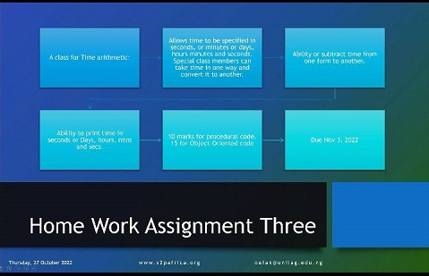

[Time Arithmetic][def5]

## Time Arithmetic Project

* [General Info][def0]

* [Technologies][def1]

* [Inputs][def2]

* [Sources][def3]

## General Info

This project involves my first oop simple python program that allows time to be specified in:

* seconds
* minute or days
* hours minutes and seconds.
It can also:
* convert the objects from one form to another.
* substract time from one form to another.
* print time in seconds or days, hours, mins and secs

## Technologies

The project is created with:

* Python version 3.9

## Inputs

The inputs/constraints are time in days, hour, minutes and seconds as arguments of class time.

## Sources

The project is inspired by a user who submitted on a data analysts platform.

I am new to python programming and aspiring data scientist. Reach out to educate me more in loops to improve my code. Thanks.

👌👌👌👌

[def1]: #technologies
[def2]: #inputs
[def3]: #sources
[def0]: #general-info
[def5]: #time-arithmetic